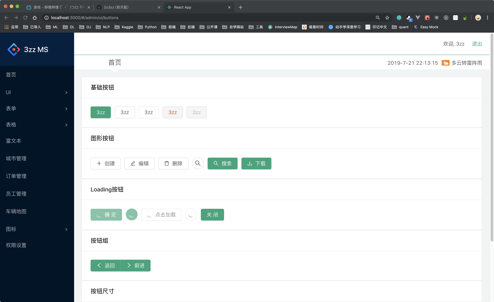

# 移动单车后台搭建

## By AntD & React

### `npm start`

Open [http://localhost:3000](http://localhost:3000) to view it in the browser.

### `npm run build`

the program will be packaged

### `the login page`

